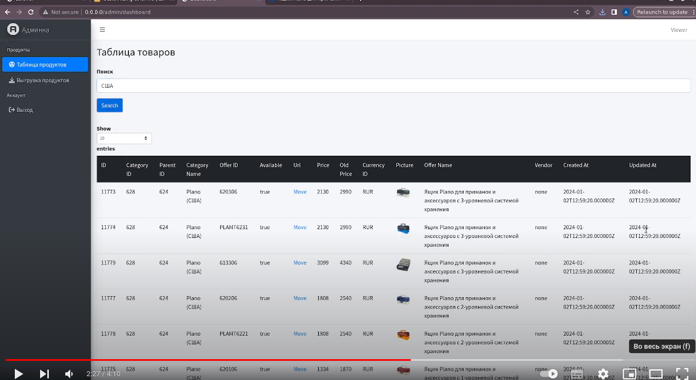

# Парсер товаров. Это сложное приложение, включающее административный интерфейс и командный функционал парсера, а также управление правами, ролями и пользователями.

Установка Docker и запуск сервера:
``./vendor/bin/sail up``

Запуск миграции:
``./vendor/bin/sail artisan migrate``

Загрузка данных в базу данных:
``./vendor/bin/sail artisan db:seed``

Команда для выполнения загрузки данных:
``./vendor/bin/sail artisan products:load``

Для просмотра и выгрузки данных в Excel в административной панели используется AdminLTE. В админке реализованы роли и права доступа для каждого пользователя, что позволяет управлять доступом к функционалу. Доступ к админке осуществляется по адресу: /admin.

# Работа с внешним API и загрузка/выгрузка данных в Excel также осуществляется через админку AdminLTE.

## Демонстрация работы приложения:

